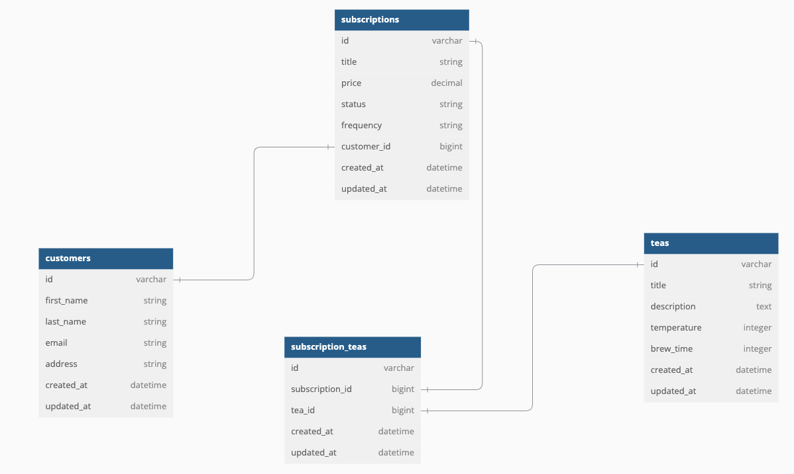

# **Tea Subscription API** 🍵

A Ruby on Rails API for managing tea subscriptions, allowing customers to explore curated tea selections, manage subscription statuses, and access detailed tea information.

---

## **Table of Contents**
1. [Overview](#overview)
2. [Features](#features)
3. [Installation](#installation)
4. [Usage](#usage)
5. [API Endpoints](#api-endpoints)
6. [Database Schema](#database-schema)
7. [Testing](#testing)
8. [Technologies Used](#technologies-used)
9. [Contributing](#contributing)
10. [License](#license)

---

## **Overview**

The **Tea Subscription API** is a backend application built with Ruby on Rails. It enables customers to manage subscriptions for weekly, monthly, or yearly tea plans. Each subscription includes details about teas, such as brewing instructions and temperatures, and customers can activate or cancel subscriptions seamlessly.

This API was developed with a clean structure, leveraging ActiveRecord for ORM and RSpec for testing. All controllers and models are thoroughly tested without the use of external gems like FactoryBot or Faker.

---

## **Features**

### **Customer Management**
- View customer details including name, email, and address.
- Retrieve individual customer information or all customers.

### **Subscription Management**
- View all subscriptions, including associated teas and customers.
- Activate or cancel subscriptions.
- Filter subscriptions by their status (`active` or `cancelled`).

### **Tea Details**
- View available teas with attributes such as:
  - Title
  - Description
  - Brewing temperature
  - Brew time

---

## **Installation**

To set up the app locally, follow these steps:

1. Clone the repository:
   ```bash
   git clone https://github.com/MDelarosa1993/Tea_Subscriptions_Api.git
   ```

2. Navigate to the project directory:
   ```bash
   cd rails-api-starter-take-home
   ```

3. Install the required gems:
   ```bash
   bundle install
   ```

4. Set up the database:
   ```bash
   rails db:{drop,create,migrate,seed}
   ```

5. Run the Rails server:
   ```bash
   rails server
   ```

The app will be running at `http://localhost:3000`.
This api is consumed by a FE: https://github.com/MDelarosa1993/Tea_Subscriptions
---

## **Usage**

### Running the Server
Start the Rails server to enable the API endpoints:
```bash
rails server
```

### Testing the Application
Run the RSpec tests for models and controllers:
```bash
bundle exec rspec
```

---

## **API Endpoints**

### **Customers**
- `GET /api/v1/customers`  
  Retrieve all customers.

- `GET /api/v1/customers/:id`  
  Retrieve details of a specific customer.

### **Subscriptions**
- `GET /api/v1/subscriptions`  
  Retrieve all subscriptions, including associated teas and customers.

- `GET /api/v1/subscriptions/:id`  
  Retrieve details of a specific subscription, including teas and the associated customer.

- `PATCH /api/v1/subscriptions/:id`  
  Update the status of a subscription (e.g., activate or cancel).

### **Teas**
- `GET /api/v1/teas`  
  Retrieve all available teas.

---

## **Database Schema**

### **Tables and Relationships**

- **Customers**:  
  Customers have many subscriptions.

- **Subscriptions**:  
  Subscriptions belong to a customer and have many teas through a join table.

- **Teas**:  
  Teas are included in multiple subscriptions through a join table.



**Example Schema Structure:**
```ruby
create_table "customers" do |t|
  t.string "first_name"
  t.string "last_name"
  t.string "email"
  t.string "address"
end

create_table "subscriptions" do |t|
  t.string "title"
  t.decimal "price"
  t.string "status"
  t.string "frequency"
  t.bigint "customer_id"
end

create_table "teas" do |t|
  t.string "title"
  t.text "description"
  t.integer "temperature"
  t.integer "brew_time"
end
```

---

## **Testing**

- All models and controllers are thoroughly tested using **RSpec**.
- Tests validate:
- Model validations (e.g., presence, numericality).
- Controller responses (e.g., successful retrieval, error handling).
- No external testing gems like FactoryBot or Faker were used.

To run tests:
```bash
bundle exec rspec
```

---

## **Technologies Used**

- **Ruby (v3.2.2)**: Programming language.
- **Ruby on Rails**: Framework for building the backend.
- **PostgreSQL**: Database for managing persistent data.
- **RSpec**: Testing framework for unit and integration tests.
- **JSON:API Serializer**: For rendering data in a JSON:API-compliant format.

---

## **Contributing**

We welcome contributions to the project! To contribute:

1. Fork the repository.
2. Create a new branch:
   ```bash
   git checkout -b feature-name
   ```
3. Make your changes and commit:
   ```bash
   git commit -m "Add new feature"
   ```
4. Push the branch:
   ```bash
   git push origin feature-name
   ```
5. Create a pull request.

---

## **License**

This project is licensed under the MIT License. See the [LICENSE](LICENSE) file for details.